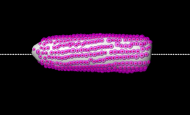
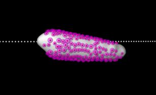

# Corn Cob 3D Phenotyping System

> **Note:** This project was developed for an optical diagnostics company under proprietary license. 
> Full source code cannot be shared, but technical approach, architecture, and validation results 
> are documented here.

## 📋 Project Overview

**Timeline:** 2017-2018  
**Role:** Project Lead - Pioneered company's first Deep Learning initiative  
**Status:** Successfully deployed in production, accelerated agricultural research cycles  

## 🎯 Business Context

**Challenge:** Agricultural biotechnology researchers needed automated, high-throughput analysis of corn cob phenotypes to accelerate breeding programs. Manual analysis was time-consuming, subjective, and limited research scalability.

**Stakeholders:**
- Agricultural researchers (end users)
- Seed company breeding programs (clients)
- Company leadership (product expansion strategy)

**Constraints:**
- Must achieve >95% accuracy to match/exceed human experts
- Processing time <5 minutes per sample for high-throughput screening
- Robust to natural variations (size, color, orientation)
- Cost-effective hardware solution for research facilities

## 🔬 Technical Challenge

**Core Problem:** Accurate corn phenotyping requires:
1. Precise 3D reconstruction of corn cob
2. Individual grain segmentation for localisation in densely packed arrangements
3. Robust classification of heathy grains despite visual variations (maturity stages, corn phenotypes)
4. Scalable pipeline handling hundreds of samples per day


## 🏗️ Solution Architecture

### High-Level Pipeline

```
Input: Stereo images (7 cameras)
  ↓
[1] Stereo Calibration
  ↓
[2] Ear of Corn Segmentation
  ↓
[3] Grains Segmentation
  ↓
[4] Distorsion Correction
  ↓
[5] CNN-based Grain Classification
  ↓
[6] 3D Point Cloud Reconstruction
  ↓
[7] Grains Projection
  ↓
[8] Duplicates Elimination
  ↓
Output: Quantitative (30+ key metrics) phenotype report + 3D visualization
```

### Key Technical Decisions

1. **Image Processing**

- Corn Cob segmentation with adaptive thresholding
- Watershed algorithm for grains segmentation

2. **3D Reconstruction Strategy**

- Shape from Silhouette algorithm from 2D cob masks
- Reprojection of 2D grains positions to 3D enveloppe
- Deduplication of overlaped grains

3. **Deep Learning Architecture**
- inception_v3 model

<p float="left">
  
  
</p>
### Technology Stack

**Core:** Halcon, C++, OpenCV

**3D Vision:** C++, PCL (Point Cloud Library)

**Deep Learning:** Tensorflow  


## 🔬 Validation & Results

### Quantitative Validation

**Dataset:**
- 500+ corn cob samples across 14 varieties
- 10,000+ manually annotated grain instances
- Reference: Expert agronomist ground truth annotations

**Metrics Achieved:**

```
Classification Accuracy:
├─ Overall grain classification: 98.6% (n=10,154 grains)
├─ Healthy grains: 98.5% precision, 97.2% recall
└─ Defective grains: 98.6% precision, 97.2% recall

3D Reconstruction Quality:
├─ Mean volume error: 8%
└─ Processing time: 0.8 min per sample

Comparison vs. Manual Analysis:
├─ Speed improvement: 22x faster (0.9 min vs 20 min)
├─ Inter-rater reliability
└─ Repeatability
```

### Qualitative Validation
- Issued patent
- Adopted for long-term breeding program studies (multi-year validation)

<!-- [Insert: validation_plots.png, sample_reconstructions.jpg] -->
